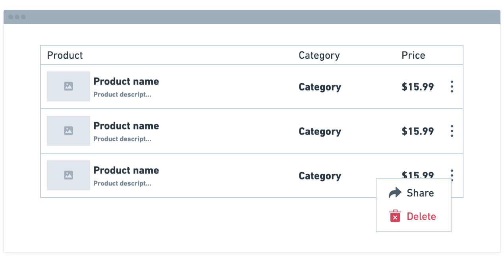
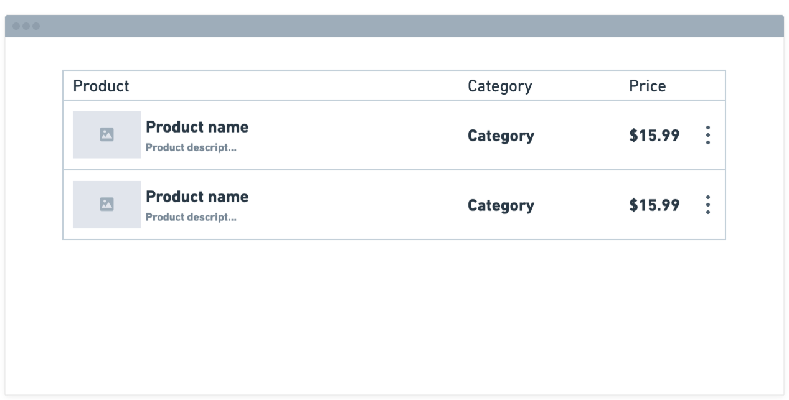
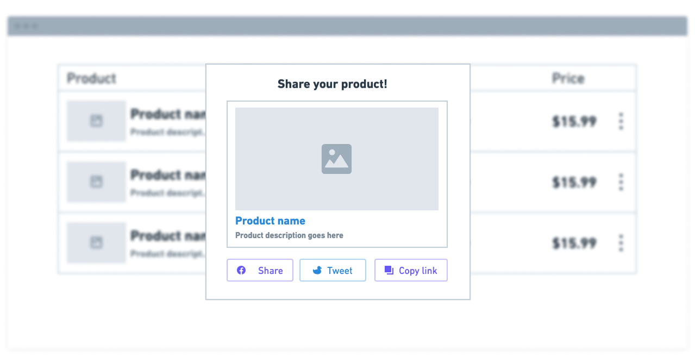

# Sellfy Frontend coding exercise

### Overview

This assignment is designed to evaluate your frontend development skills. You are required to build a simple web application that displays a list of products in a table format.

Before we go further, please note that it doesn’t matter if we finish the exercise: we’re looking to see how you break down a problem and turn it into executable code! We are looking for code which:

- is not AI generated
- is readable and maintainable
- is well-testable
- follows the best practices of your chosen language/platform


## Scenario
We need to output a products table with the few option hidden under dropdown menu.



### Delete action
When user clicks on "Delete" button, product should be removed from the page and table should be re-rendered without that product.



### Share action
When user clicks on the "Share" button, we should show a modal window with the information about the product and two buttons that would represent social sharing as well as "Copy" product URL button.




## Available data
There is an HTTP API we can use to retrieve data about the products

```
GET https://raw.githubusercontent.com/Sellfy/test-assignment-frontend/refs/heads/master/products.json HTTP/1.1

{
  "data": [
    {
      "_id": "67472f65d2c7c1a0cf655924",
      "price": 2599,
      "name": "Wireless Headphones",
      "description": "High-quality wireless headphones with noise cancellation.",
      "currency": "USD",
      "category": "Electronics",
      "url": "https://example.com/product/67472f65d2c7c1a0cf655924",
      "image_url": "https://github.com/Sellfy/test-assignment-frontend/raw/refs/heads/master/images/image-1.jpg"
    },
    .....
  ],
  "pagination": {
    "page": 1,
    "total_pages": 1,
    "total_items": 5
  }
}
```


### Notes
- Add pagination if you wish, but it is not required for this dataset.
- Make the table responsive for mobile devices.
- You are free to use any frontend framework or library (e.g., React, Vue, Angular, Svelte, Vanilla JS, etc.).
- The UI should be clean and user-friendly. You may use any UI library or write your own styles.
- **Do not use AI tools to write code.** The goal is to assess your own coding and problem-solving skills.


### Submission

1. Push your code to a public Git (GitHub/Gitlab) repository.
2. Include clear instructions on how to run your application in the `README.md`.
3. Be prepared to discuss your code and design decisions during the interview.
